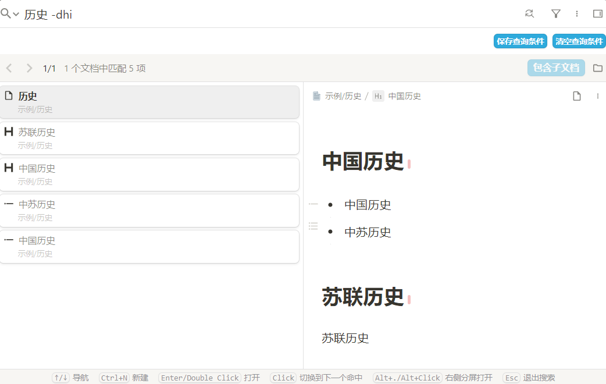
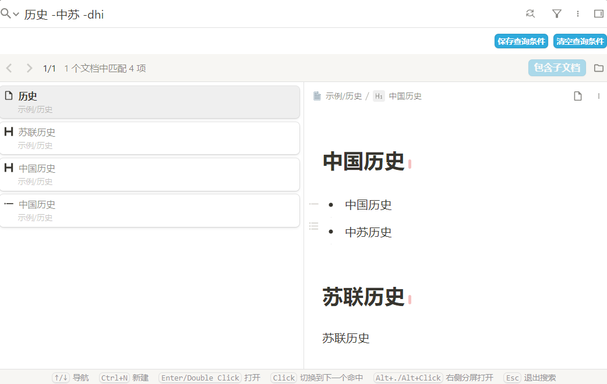
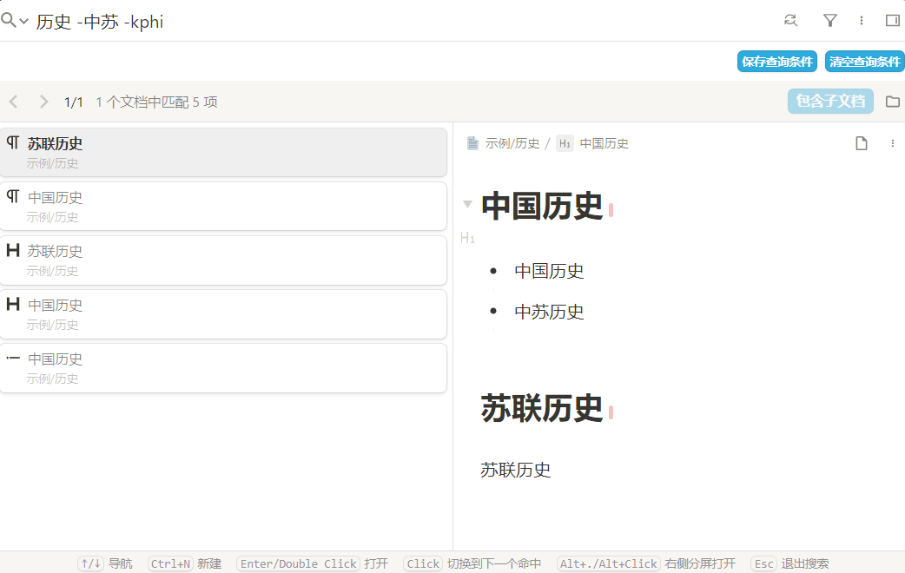
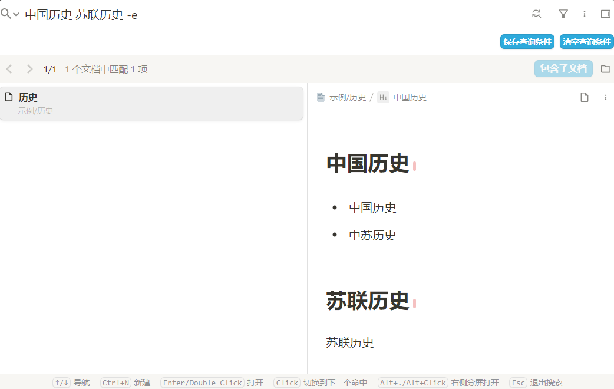

本插件旨在为常用的搜索操作提供简单快捷的搜索方法，主要功能包括：搜索类型过滤、关键词排除、在当前文档搜索以及搜索范围扩展。

**搜索选项汇总：**

- 块类型过滤
  - `d` 文档块（仅在文档名上搜索，不会搜索文档包含内容块）
  - `h` 标题块（仅在标题名上搜索，不会搜索标题块下方内容块）
    - `h`+`数字1-6` 指定标题等级，如 `h123`表示搜索 1、2、3 级标题
  - `l` 列表块（包含有序列表块、无序列表块和任务列表块）
  - `i` 列表项块
  - `c` 代码块
  - `m` 数学公式块
  - `t` 表格块
  - `b` 引述块
  - `s` 超级块
  - `p` 段落块
  - `o` 未完成的待办项(todo)，`O` 已完成的待办项
  - `L` 表示带有链接的块（非思源标准的块类型）
- 关键词排除
  - `-`+`要排除的关键词`，排除指定关键词
- `-k`（current） 在当前文档搜索
  - `-K`可在当前文档及子文档搜索
- `-e`（extension）扩展搜索

# 1. 搜索类型过滤

当使用关键词搜索时如何快速过滤想要的块类型？

搜索时在关键词后输入`-`+`块类型`即可在搜索结果中过滤指定类型的块。

例如，使用`历史 -dhi`即可搜索包含`历史`的文档块(`d`)、标题块(`h`)以及列表项块(`i`)，同时搜索结果会按照输入的块类型排序，如上述搜索会按照文档块(`d`)、标题块(`h`)以及列表项块(`i`)的顺序排序。

常用的块类型有：

- `d` 文档块（仅在文档名上搜索，不会搜索文档包含内容块）
- `h` 标题块（仅在标题名上搜索，不会搜索标题块下方内容块）
    - `h`+`数字1-6` 指定标题等级，如`h123`表示搜索 1、2、3 级标题
- `l` 列表块（包含有序列表块、无序列表块和任务列表块）
- `i` 列表项块
- `c` 代码块
- `m` 数学公式块
- `t` 表格块
- `b` 引述块
- `s` 超级块
- `p` 段落块
- `o` 未完成的待办项(todo)，`O` 已完成的待办项
- `L` 表示带有链接的块，非思源标准的块类型

# 2. 关键词排除

在搜索时如何快速排除不想要的关键词？

搜索时在关键词后输入`-`+`要排除的关键词`即可搜索关键词并排除指定关键词，并且关键词排除与搜索类型过滤可搭配使用。

例如，使用`历史 -中苏 -dhi`即可搜索包含`历史`但不包含`中苏`的文档块(`d`)、标题块(`h`)以及列表项块(`i`)，同时搜索结果会按照输入的块类型排序。支持排除多个关键词，只需继续输入`-`+`要排除的关键词`即可。

# 3. 在当前文档（子文档）搜索

在当前文档搜索除了使用 `Ctrl+F` 还能怎么做？

搜索时在关键词后输入`-k`（current）即可在当前文档搜索。
搜索时在关键词后输入`-K`可在当前文档及子文档搜索。同样的，`-k`和`-K`可以与搜索类型过滤、关键词排除结合使用。

例如，使用`历史 -中苏 -kphi`即可在当前文档中搜索包含`历史`但不包含`中苏`的段落块(`p`)、标题块(`h`)以及列表项块(`i`)，同时搜索结果会按照输入的块类型排序。

# 4. 搜索范围扩展

当想要搜索同时包含`中国历史`和`苏联历史`的文档而这两个关键词又不在一个块内该怎么办？

搜索时在关键词后输入`-e`（extension）即可搜索同时包含`中国历史`和`苏联历史`的文档，注意`-e`不可与搜索类型过滤、当前文档搜索结合使用。

# 5. 使用默认搜索方法

在使用本插件后，默认的搜索方法已被本插件屏蔽，那么如果想要使用默认的搜索方法该怎么办？

在搜索时使用 `-+搜索方法+搜索关键词`即可使用默认的搜索方法进行搜索。默认搜索方法分别为：

- `w`（keywords）关键字
- `q`（query syntax）查询语法
- `s`（SQL）SQL语句搜索
- `r`（regex）正则表达式

比如使用`-q中国历史 NOT 苏联`即可使用查询语法搜索`中国历史 NOT 苏联`，使用`-s + SQL语句`即可使用SQL搜索。

# 6. 反馈与建议

可在[【插件】简易搜索 - 更高效的搜索方式 - 链滴](https://ld246.com/article/1689344075636)或[Issues · choyy/simple-search](https://github.com/choyy/simple-search/issues)或某QQ群提交反馈或建议。

# 7. 更新日志

- v0.2.2，**未指定搜索类型时应选择设置中启用的块类型**
- v0.2.1，修复bug
- v0.2.0，支持高亮搜索关键词
- v0.1.3，继续修复点击标签搜索问题
- v0.1.2，修复点击标签触发搜索时关键词不为标签的问题
- v0.1.1，扩展搜索时自动按文档分组，适配 2.11.4
- v0.1.0，支持`-[oO]`搜索待办项，支持`-L`搜索带有链接的块
- v0.0.12，适配 2.11.1
- v0.0.10，支持搜索页签，新增`-K`在当前文档及子文档搜索
- v0.0.9，支持搜索子标题
- v0.0.8，扩展范围搜索忽略容器块
- v0.0.7，支持 docker 及浏览器端
- v0.0.6，扩展范围搜索显示到块
- v0.0.5，扩展范围搜索按照修改时间降序排序
- v0.0.4，修复bug
- v0.0.3，修复bug
- v0.0.2，提升扩展范围搜索的搜索速度
- v0.0.1，初版